<h1 align="center">Laboratorio móvil de modelación y control</h1>
<h3 align="center">ITESM - ALGETEC</h1>

## Conócenos :dvd:
La empresa EdTech Algetec+ en colaboración con el Tecnológico de Monterrey desarrollan un proyecto de investigación educativa, que proporciona una amplia variedad de opciones experimentales (virtual, presencial y combinaciones) con el propósito de crear una metodología de enseñanza - aprendizaje que potencie el nivel de competencias ingenieriles alcanzado por los estudiantes. La misión de este laboratorio se centra en formar a los estudiantes, principalmente a carreras relacionadas con control de procesos y automatización. Sin embargo, se busca hacer que la plataforma sea accesible para otras carreras con interés en conocer nuevas herramientas de modelación matemática, instrumentación (sensores, actuadores y señales), una pequeña inducción al control e incentivar a la comunidad a explorar sobre el área de control y sus aplicaciones en la actualidad.

## Tabla de contenido
- [Componentes](#seccion-1)
- [Indicaciones de seguridad para prevenir accidentes](#seccion-2)
- [Diagrama de tuberías](#seccion-3)
- [Prácticas](#seccion-4)
- [Video](#seccion-5)
- [Tecnologías](#seccion-6)
- [Colaboradores](#seccion-7)

  

## Componentes  👩‍💻
:small_red_triangle_down: ***Bomba centrífuga trifásica***

  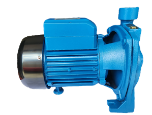

**Uso en el sistema:**
Este motor eléctrico se encarga de desplazar el flujo de agua guardado en el almacén al sistema, este flujo se mueve por medio de un sistema de tuberías.

:small_red_triangle_down: ***Vaso de Presión***

  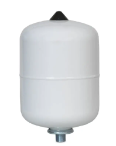

**Uso en el sistema:**
Se utiliza para evitar que el sistema presente variaciones abruptas de presión.

:small_red_triangle_down: ***Sensor de caudal***

  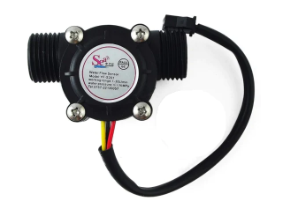

**Uso en el sistema:** 
Este sensor indica la medición del caudal que se está recorriendo por la tubería. Cuando se hace la lectura, este sensor envía una señal al dispositivo encargado de leer la señal

:small_red_triangle_down: ***Sensor de nivel láser***

  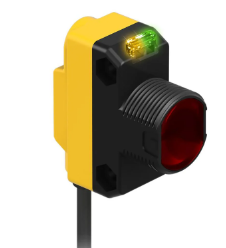

**Uso en el sistema:** 
Este dispositivo emite un láser que refleja el flujo, cuando capta la señal que él mismo utiliza para distinguir el nivel de flujo dentro del tanque.

:small_red_triangle_down: ***Manómetro***

  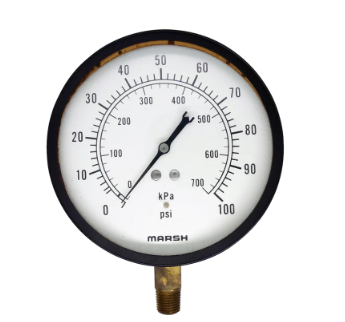

**Uso en el sistema:** 
Sirve para medir la presión dentro de la tubería. Sus unidades son en psi y kgf/cm2.

:small_red_triangle_down: ***Sensor de nivel capacitivo***

  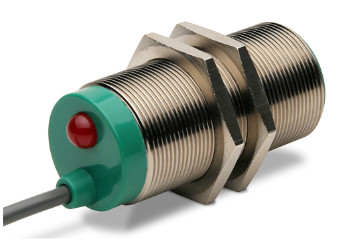

**Uso en el sistema:** 
Este sensor identifica y envía una señal a la computadora para informar qué el fluido ha alcanzado el punto donde se ha instalado.

:small_red_triangle_down: ***Sensor de presión***

  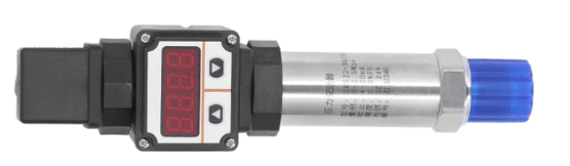

**Uso en el sistema:** 
Mide la presión que hay dentro de la tubería.

:small_red_triangle_down: ***Sensor de temperatura***

  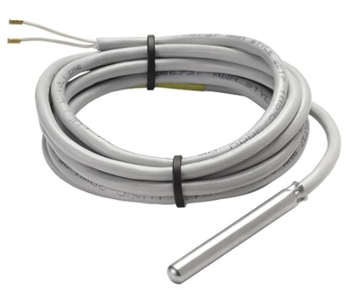

**Uso en el sistema:** 
Su función es medir la temperatura del fluido en el tanque.

:small_red_triangle_down: ***Rotámetro***

  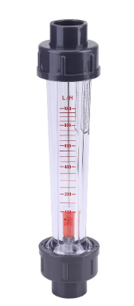

**Uso en el sistema:** 
Este dispositivo se encarga de medir el caudal; mediante el desplazamiento del fluido y haciendo que el cono (interno) de medición se desplace. Sirve para identificar cuántos litros por hora están siendo transportados a través del rotámetro.

## Indicaciones de seguridad para prevenir accidentes ⚠️ 🚧

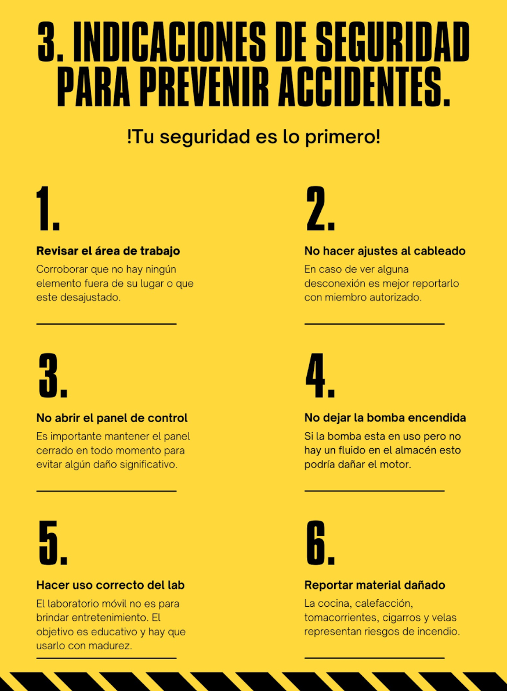

## Diagrama de tuberías  🔌

  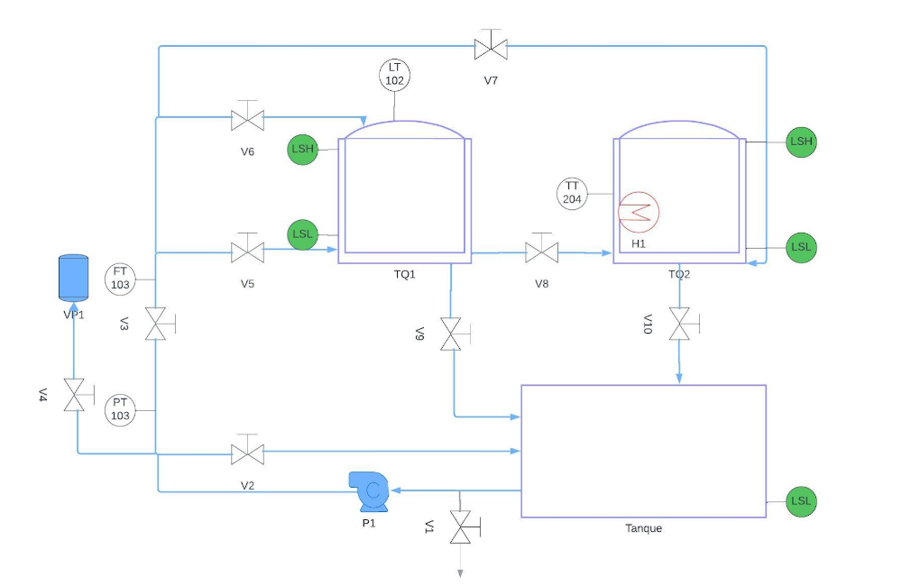

## Prácticas 🛠️

1. 

## Video 📹

## Tecnologías 📱

- Matlab

- ALGETEC+

- Python

- 

## Colaboradores 🦺
En esta sección están las personas que han sido colaboradores dentro del repositorio del laboratorio móvil, como una manera de agradecimiento por sus contribuciones al laboratorio de control

- Debbie Crystal Hernández Zárate - Profesora en el Tecnológico de Monterrey Campus Puebla 👩‍🏫

- Marybeth Flores Vázquez - Profesora en el Tecnológico de Monterrey Campus Puebla 👩‍🏫

- Ricardo Garcia Sedano

<!---
labmovilITESM/labmovilITESM is a ✨ special ✨ repository because its `README.md` (this file) appears on your GitHub profile.
You can click the Preview link to take a look at your changes.
--->
